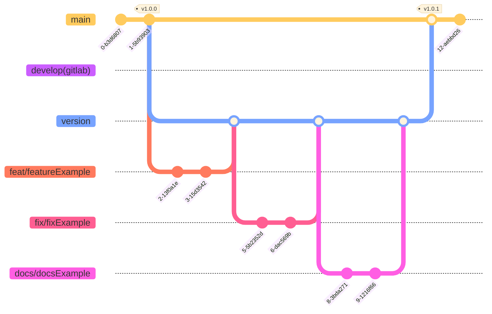

### Git Commit Rule

> This is adapted from [Angular's commit convention](https://github.com/conventional-changelog/conventional-changelog/tree/master/packages/conventional-changelog-angular).

Git commits should adhere to the following rule to automatically generate changelogs:

```
# Follow the Angular commit conventional format
/^(revert: )?(feat|fix|docs|refactor|perf|test|workflow|ci|chore|types)(\(.+\))?: .{1,50}/
```

We utilize three tags to simplify the rules:

- `feat:` for new features
- `fix:` for bug fixes
- `doc:` for documentation changes.

### Git Flow (Branch Rule)



- `feat/<yourBranchName>` ：develop new feature
- `fix/<yourBranchName>`：edit old feature
- `docs/<yourBranchName>` ：add docs or example
- `<version>` : the version before release ex. 2.0.0
- `develop` ：only for gitlab branch, for rebase github master branch. Not exist in github develop flow
- `master` ：github main branch, only update by merge request