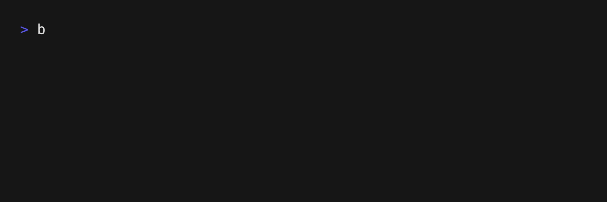

<div align="center">
<h1>Blockchain Development Kit</h1>
<pre>
            ::::::::    :::::::     :::    :::
         :+:   :+:   :+:   :+:   :+:   :+:
      +:+    +:+  +:+    +:+  +:+  +:+
   +#++:++#+   +#+    +:+  +#++:++
  +#+    +#+  +#+    +#+  +#+  +#+
 #+#   #+#   #+#   #+#   #+#   #+#
########    ########    ###    ###
</pre>

[](https://www.npmjs.com/package/@cathaybc/bdk) [](./LICENSE) [](https://github.com/cathayddt/bdk/actions/workflows/codeql.yml) [](https://github.com/cathayddt/bdk/actions/workflows/test-report.yml) [](https://github.com/cathayddt/bdk/actions/workflows/unit-test.yml)
</div>

提供指令快速建立、管理、監控 blockchain，最大的特色是可以使用互動式的問答，讓使用者可以依續性的問答來完成指令所需要的指令，在每個 BDK 指令的後面，加入 `-i` 或是 `--interactive` 的參數，來使用互動式問答

BDK streamlines the normally complicated process of creating a blockchain with command-line tools and npm packages. Creating, managing, monitoring a blockchain network has never been easier. We support interactive prompts which can be triggered with `-i` or `--interactive` behind all cli commands

e.g.

```
bdk eth network create -i
```
#### Quorum

#### Besu


```bash
bdk fabric network create -i
```
#### Fabric


## 版本 (Releases)

|      Latest      |      Stable      |
| ---------------- | ---------------- |
| [v3.4.0][v3.4.0] | [v3.4.0][v3.4.0] |

[v3.4.0]: https://github.com/cathayddt/bdk/releases/tag/v3.4.0

[更新內容 (Changelog)](CHANGELOG.md)

## 文件 (Documentation)

- 指令文件 CLI Documentation (Work in Progress)
- [Fabric 使用範例 (Examples)](docs/fabric/EXAMPLE.md)
- [Quorum 使用範例 (Examples)](docs/eth/EXAMPLE.md)
- [Besu 使用範例 (Examples)](docs/eth/EXAMPLE.md)
- [開發指南 (Contributing)](.github/CONTRIBUTING.md)
- [資安通報 (Security Issues)](SECURITY.md)

## 安裝流程 (Getting Started)

### 環境 (Prerequisites)

- [npm + nodejs](https://docs.npmjs.com/downloading-and-installing-node-js-and-npm) node v18, npm v9
- [docker](https://docs.docker.com/engine/install)
- [docker-compose](https://docs.docker.com/compose/install) >= 2.20
- [docker-desktop(MacOS)](https://www.docker.com/products/docker-desktop/) Need Allow Docker Sockers in Advanced Options 
- eslint (vscode plugin, dev-only)

### 主程式安裝 (Installation)

#### 直接安裝 (Direct Install)

```bash
npm install -g @cathaybc/bdk@latest

# 初始化 (initialize)
bdk fabric config init
```

#### 從原始碼安裝 (Install from Source)

```bash
git clone https://github.com/cathayddt/bdk.git
cd bdk

npm install

npm run build:console
```

## 設定 (Configuration)

### 設定自動完成 (Configure AutoComplete)

```bash
bdk completion
```

腳本 (script source is as follows)

```bash
###-begin-bdk-completions-###
#
# yargs command completion script
#
# Installation: bdk completion >> ~/.zshrc
#    or bdk completion >> ~/.zsh_profile on OSX.
#
_bdk_yargs_completions()
{
  local reply
  local si=$IFS
  IFS=$'
' reply=($(COMP_CWORD="$((CURRENT-1))" COMP_LINE="$BUFFER" COMP_POINT="$CURSOR" bdk --get-yargs-completions "${words[@]}"))
  IFS=$si
  _describe 'values' reply
}
compdef _bdk_yargs_completions bdk
###-end-bdk-completions-###
```

## Hello BDK

使用以下的指令，可以確認 BDK 已安裝完成並且可以開始操作使用

Use the following command to verify that BDK has completed installation and is now ready to be used.

```bash
bdk hello
```

如果指令已順利安裝，你會看到 `You have installed bdk successfully!!!` 

You will see `You have installed bdk successfully!!!` if the command line tool is installed successfully.

## 建立一個 Test Network (Create a test network)

使用以下指令，可以建立一個簡單的 Hyperledger Fabric 網路

Use the following command to create a simple Hyperledger Fabric Network.

```bash
  # create network
  bdk fabric network create --test-network
  # start orderer docker container (interactive mode)
  bdk fabric orderer up -i
  # start peer docker container (interactive mode)
  bdk fabric peer up -i
```

## LICENSE

[Apache2.0](LICENSE)

[src/quorum/instance/infra/kubernetes/charts](./src/quorum/instance/infra/kubernetes/charts) follow [quorum-kubernetes](https://github.com/Consensys/quorum-kubernetes/) repository
